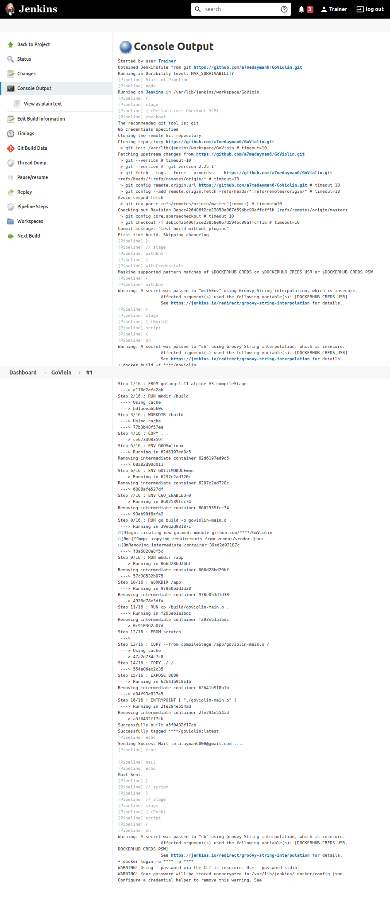

# GoViolin

### GoViolin is a web app written in Go that helps with violin practice.

Currently hosted on Heroku at https://go-violin.herokuapp.com/

# Table of Contencts

1. [Features](#features)
2. [Used DevOps Tools and Technologies](#ci-cd-pipeline)
3. [Run using Docker](#run-docker)
4. [Enable Jenkins pipeline on your machine](#pipeline)
5. [Dockeraize GoViolin - How ?](#dockeraize)
6. [Building the pipeline](#pipeline-build)
7. [Deployment on Kubernetes](#k8s-deployment)
8. [GitHub Actions Workflow](#githubactions)
9. [Jenkins Console Output](#jenkins-output)
10. [Success Emails](#emails) 
11. [Pipeline Features](#pipeline-features)

<a name="features"></a>

# Features

GoViolin allows practice over both 1 and 2 octaves.

* Major Scales
* Harmonic and Melodic Minor scales
* Arpeggios
* A set of two part scale duet melodies by Franz Wohlfahrt

<a name="run-docker"></a>

# RUN Using Docker

```bash
docker run -p 8080:8080 a7medayman6/goviolin
```
- Now you can access the web app from your browser at http://localhost:8080
- *NOTE: IF YOU'RE RUNNING ANYTHING ON PORT 8080 CHANGE THE HOST PORT (THE FIRST 8080 IN THE COMMAND) TO ANY OTHER FREE PORT*

<a name="ci-cd-pipeline"></a>

# Used DevOps Tools and Technologies 


<a name="pipeline"></a>


# Enable Jenkins pipeline on your machine

**NOTE: THE PUSH STAGE TAKES TIME**

**NOTE: MAKE SURE TO INSTALL AND START minikube ON THE SERVER FOR THE DEPLOYMENT TO WORK PROPERLY**

```BASH
minikube start
```

To Get the Live URL using

```bash
minikube service goviolin-service --url
```

#### Step 0 - Fork and edit

- Fork the repo and edit *IMAGE* Env variable in [Jenkinsfile](Jenkinsfile) to your dockerhub-username/goviolin

#### Step 1 - Install Docker and Jenkins

- Install and Configure [Docker](https://www.docker.com/) and [Jenkins](https://www.jenkins.io/) on your machine.

#### Step 2 - Install Jenkins Plugins

##### SKIP THIS STEP IF YOU DON'T WANT TO INSTALL PLUGINS, WITHOUT THIS STEP YOU WILL USE THIS JENKINS FILE THAT USES NO PLUGINS

- Rename [Jenkinsfile](Jenkinsfile) to Jenkinsfile-without-plugins
- Rename [Jenkinsfile-using-plugins](Jenkinsfile-using-plugins) to Jenkinsfile

- From [Jenkins Plugins](https://plugins.jenkins.io/) install Docker Pipeline, CloudBees Docker Build, and Publish plugin, and git

#### Step 3 - Credentials and Github Webhook

- Create [credentials on Jenkins](https://www.jenkins.io/doc/book/using/using-credentials/) for DockerHub and GitHub
- Create [Webhook](https://docs.github.com/en/developers/webhooks-and-events/webhooks/creating-webhooks) on Github

#### Step 4 - Create the pipeline

- Create a new item on jenkins
- Give it a name
- Select pipeline

#### Step 5 - Configure the pipeline

- Enable GitHub hook trigger for GITScm polling at Build Triggers
- Choose Definition Pipeline script from SCM - SCM: Git and add your repository URL
- Click ok

#### Step 6 - Trigger the pipeline

- Push something to git repository, or from jenkins click Build now to check that the build is done correctly 

<a name="dockeraize"></a>


# Dockeraize GoViolin - How ?
**Steps of dockeraizing this application from A to Z**

#### Step 1 - Build Locally

- Find out how to build the app locally, what are the dependencies we need, which programming language
- After some poking around I figured that I can simply build the application using one command
```bash
go build -o goviolin.o .
```
- Then run the binary file
```bash
./goviolin.o
```

#### Step 2 - Planning Dockerfile

- Which image should I base my image on ?
- Do I need to install any dependencies in the container ?
- I choose golang:alpine image to build on top of it, because it's small and have go already installed which is all I need to build the app

#### Step 3 - Write and Test Initial Dockerfile

- Write down the **initial** Dockerfile
```docker
# The base image to build the application on top of
FROM golang:1.11-alpine AS compileStage

# create a new directory for the build 
RUN mkdir /build

# change the working directory to /build to get the code and build it
WORKDIR /build

# copy the source code into the container
COPY . .

# Set env variables for go
# OS
ENV GOOS=linux
# GO Module
ENV GO111MODULE=on

ENV CGO_ENABLED=0

# Build the go application
RUN go build -o goviolin-main.o .

RUN mkdir /app
WORKDIR /app

RUN cp /build/goviolin-main.o .

# Expose the port the application will run on
EXPOSE 8080

# Run the binary file
ENTRYPOINT [ "./goviolin-main.o" ]
```
- Build it using
```bash
docker build -t goviolin .
```
- Test it using
```bash
docker run -p 8082:8080 goviolin
# I'am running jenkins on port 8080 so am mapping the container port 8080 to host port 8082 
```

#### Step 4 - Reduce the image size

- Currently the image size is approximately 500 MB which is too much in terms of containers
- So I thought I could use Docker Multi-stagging to move the binary file and it's dependencies 
after building it based on a golang image to a lighter container
- I built a new image from scratch, copied the binary and it's dependencies into the new image, exposed the port, and executed the binary file
- This will reduce the size down a lot since the intermediate container - golang:alpine - will get removed 
- So here's the docker file after applying the modifications => [Dockerfile](Dockerfile)
- Test it again .. It Works ! The size now is 220 MB!

<a name="pipeline-build"></a>

# Building the pipeline

#### Step 1 - Plan the pipeline

Push Commits => Source Control Management => Jenkins takes the source code => Jenkins Builds docker image => Jenkins Push to Docker Hub 


#### Step 2 - Credentials and Github Webhook

- Create [credentials on Jenkins](https://www.jenkins.io/doc/book/using/using-credentials/) for DockerHub and GitHub
- Create [Webhook](https://docs.github.com/en/developers/webhooks-and-events/webhooks/creating-webhooks) on Github

#### Step 3 - Jenkinsfile

- Using jenkins declarative pipeline
- Questions to ask when building a pipeline :
    1. What are the stages do I need ?
    2. Diving into each stage independently
    3. What are the ENV variable do I need ?
    4. What do I need to clean up the environment after the build ?
- So in our case, we need 3 stages (in addition to the CHECKOUT SCM)
    1. build (build the image from docker file)
    2. push (push the image to the registry)
    3. cleanup (remove the local image)
- Here is Jenkinsfile after applying the previous steps => [Jenkinsfile](Jenkinsfile)

<a name="k8s-deployment"></a>

# Deployment on K8s

[**Deployment File**](deployment.yaml)

- Deployment
  - Specified 1 replica only for now.
  - Set the container image to be [a7medayman6/goviolin](https://hub.docker.com/repository/docker/a7medayman6/goviolin) 
  - Set the container port to be 8080 which is the web app port
- Service 
  - Set the service to work with TCP protocol 
  - the port forwarding to 8082 
  - the target port to 8080
  - set a node port to 32000 (this is arbitrary port in the right range)
  - the type to loadbalancer (to when this get deployed on server not localhost)

Then tested it locally before integrating with jenkins by 

```bash
kubectl apply -f deployment.yaml
```

Then Get the Live URL using

```bash
minikube service goviolin-service --url
```


<a name="githubactions"></a>

# Github Actions Workflow

[Workflow Yaml File](./.github/workflows/docker-publish.yml)

Configured a CI pipeline using github actions to build and push the docker image  to the registry.

<a name="jenkins-output"></a>

# Jenkins Console Output

- Build Stage 




 

- Push and Deploy Stages

  

<a name="emails"></a>

# Success Emails


Build            	      |  Push                      | Deploy            	      
:-------------------------:|:-------------------------:|:-------------------------:
  |   | 

# Pipeline Featuress

On each commit or pull request to the GitHub repo

- Build Dockerimage for GoViolin Web Application
- Push the Built Image to Dockerhub 
- Deploy an instance of the application on kubernetes and make it accessible to the web 
- Also the pipeline reports by email for the success or failure of any stage  